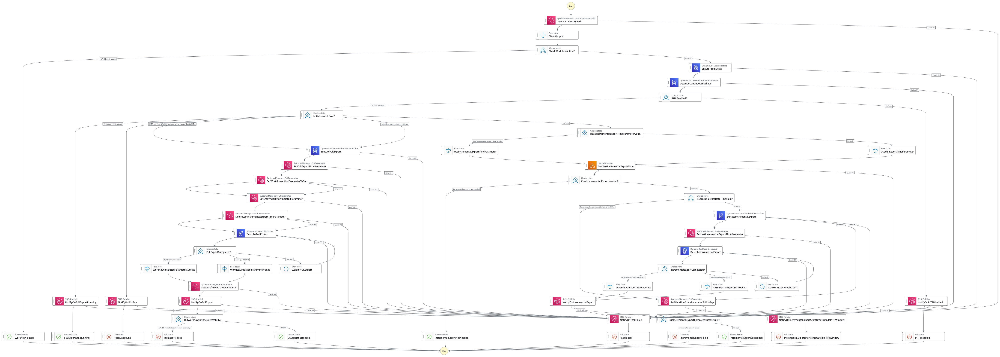
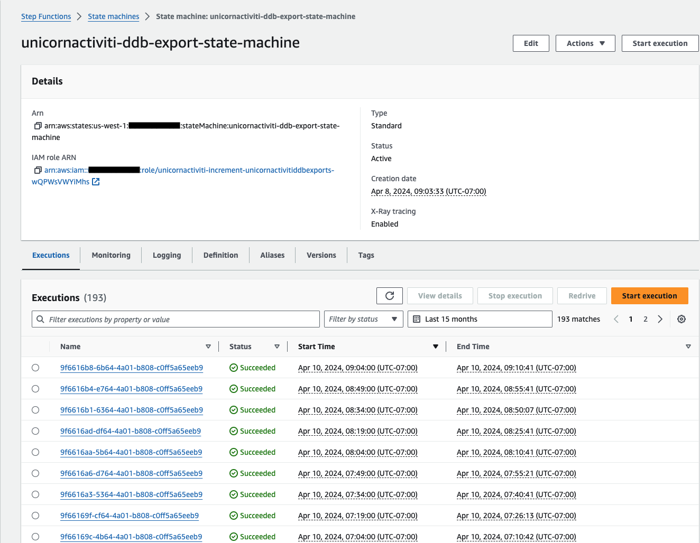
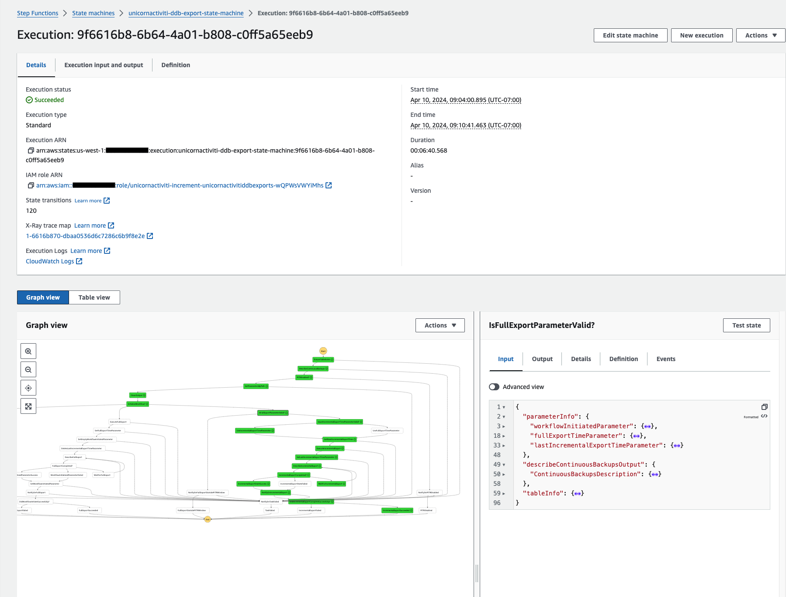

# Continuous incremental export for your DynamoDB table to S3
This workflow allows you to continuously export a DynamoDB table to S3 incrementally every _f_ minutes (which defines the _frequency_). Traditionally exports to S3 were full table snapshots but since the [introduction of incremental exports](https://docs.aws.amazon.com/amazondynamodb/latest/developerguide/S3DataExport.HowItWorks.html) in 2023, you can now export your DynamoDB table between two points in time. 

With this repository you can quickly start exporting data from your DynamoDB table with minimal effort. Follow the [Usage](#usage) guide to get started.

## Prerequisites
1. Install [AWS CDK](https://docs.aws.amazon.com/cdk/v2/guide/getting_started.html)
1. An existing DynamoDB table with [PITR](https://aws.amazon.com/dynamodb/pitr/) enabled

## Usage
1. All you need is a DynamoDB Table with [PITR](https://aws.amazon.com/dynamodb/pitr/) enabled
1. [Clone](https://github.com/aws-samples/dynamodb-continuous-incremental-exports.git) the repository using `git clone https://github.com/aws-samples/dynamodb-continuous-incremental-exports.git`
1. Change directory using `cd dynamodb-continuous-incremental-exports`
1. Install NPM packages using `npm install`
1. Note that commands below are for `bash` on a MacOS
1. Deploying the solution requires some parameterized values. The easiest way to set these is to create shell environment variables.
    1. `TABLE_NAME` - The name of your table, also used to create the stack name. Each table gets its own stack.
    1. `DEPLOYMENT_ALIAS` - The alias of your deployment, ensures all infrastructure created can be grouped/identified. Can only contain lower case alphanumeric characters with a maximum of 15 characters. Recommend to use a string which maps closely to your DynamoDB table name. E.g. if your DynamoDB table is called `unicorn_activities` then the _DEPLOYMENT__ALIAS_ could be `unicornact`.
    1. `SUCCESS_EMAIL` - Email address to be notified when the workflow succeeds.
    1. `FAILURE_EMAIL` - Email address to be notified if the workflow fails.
    1. Putting it all together
        ```bash
        TABLE_NAME=YourTableName
        DEPLOYMENT_ALIAS=YourDeploymentAlias
        SUCCESS_EMAIL=success-tablename@example.com
        FAILURE_EMAIL=failure-tablename@example.com
        ```
1. Now execute `cdk synth` (uses the above environment variables):
    ```bash
    cdk synth --quiet \
        -c stackName=$DEPLOYMENT_ALIAS-incremental-export-stack \
        -c sourceDynamoDbTableName=$TABLE_NAME \
        -c deploymentAlias=$DEPLOYMENT_ALIAS \
        -c successNotificationEmail=$SUCCESS_EMAIL \
        -c failureNotificationEmail=$FAILURE_EMAIL
    ```
1. Deploy the solution using `cdk deploy`
    ```bash
    cdk deploy \
        -c stackName=$DEPLOYMENT_ALIAS-incremental-export-stack \
        -c sourceDynamoDbTableName=$TABLE_NAME \
        -c deploymentAlias=$DEPLOYMENT_ALIAS \
        -c successNotificationEmail=$SUCCESS_EMAIL \
        -c failureNotificationEmail=$FAILURE_EMAIL
    ```

### Redeployment
If you are redeploying the solution and have decided to keep the export data bucket (and prefix) intact then the bucket name (and prefix) will need to be passed into the `cdk synth` and `cdk deploy` steps. This ensures your existing export data bucket (and prefix) are used.

#### No bucket and/or prefix specified in original deployment
Ensure you extract the export data bucket name (export named `$DEPLOYMENT_ALIAS-data-export-output`) from the output parameters of the CDK deployment. 


#### Bucket and/or prefix specified in original deployment
Use the same parameterized values.

#### Steps
Your redeployment process would look like below:
1. Setup parameterized values
    ```bash
    TABLE_NAME=YourTableName
    DEPLOYMENT_ALIAS=YourDeploymentAlias
    SUCCESS_EMAIL=success-tablename@example.com
    FAILURE_EMAIL=failure-tablename@example.com
    BUCKET_NAME=somebucket
    BUCKET_PREFIX=someprefix
    ```
2. Now execute `cdk synth` (uses the above environment variables):
  ```bash
  cdk synth --quiet \
      -c stackName=$DEPLOYMENT_ALIAS-incremental-export-stack \
      -c sourceDynamoDbTableName=$TABLE_NAME \
      -c deploymentAlias=$DEPLOYMENT_ALIAS \
      -c successNotificationEmail=$SUCCESS_EMAIL \
      -c failureNotificationEmail=$FAILURE_EMAIL \
      -c dataExportBucketName=$BUCKET_NAME \
      -c dataExportBucketPrefix=$BUCKET_PREFIX
  ```
1. Deploy the solution using `cdk deploy`
  ```bash
  cdk deploy \
      -c stackName=$DEPLOYMENT_ALIAS-incremental-export-stack \
      -c sourceDynamoDbTableName=$TABLE_NAME \
      -c deploymentAlias=$DEPLOYMENT_ALIAS \
      -c successNotificationEmail=$SUCCESS_EMAIL \
      -c failureNotificationEmail=$FAILURE_EMAIL \
      -c dataExportBucketName=$BUCKET_NAME \
      -c dataExportBucketPrefix=$BUCKET_PREFIX
  ```

## Cleanup
You can cleanup the resources deployed by the solution by executing the `cdk destroy` command
```bash
cdk destroy \
    -c stackName=$DEPLOYMENT_ALIAS-incremental-export-stack \
    -c sourceDynamoDbTableName=$TABLE_NAME \
    -c deploymentAlias=$DEPLOYMENT_ALIAS
```

You can delete the resources created at runtime (CloudWatch Logs and SSM Parameters) using the below commands:
```bash
aws ssm delete-parameters --names \
    "/incremental-export/$DEPLOYMENT_ALIAS/full-export-time" \
    "/incremental-export/$DEPLOYMENT_ALIAS/last-incremental-export-time" \
    "/incremental-export/$DEPLOYMENT_ALIAS/workflow-initiated" \
    "/incremental-export/$DEPLOYMENT_ALIAS/workflow-state" \
    "/incremental-export/$DEPLOYMENT_ALIAS/workflow-action"

aws logs delete-log-group \
    --log-group-name $DEPLOYMENT_ALIAS-incremental-export-log-group
```

### S3 cleanup [Optional]
#### Data export bucket
Clearing the exported data from S3 **(CAUTION: Results in data loss)**
1. Prefix specified
    If you have specified a prefix then ensure you **only delete objects under that prefix** (e.g. where `BUCKET_PREFIX` is your prefix)
    ```bash
    aws s3 rm s3://$DEPLOYMENT_ALIAS-data-export/$BUCKET_PREFIX --recursive
    ```
1. If you have not specified a prefix, you will want to delete all objects under the bucket and the bucket itself
    ```bash
    aws s3 rm s3://$DEPLOYMENT_ALIAS-data-export --recursive
    aws s3api delete-bucket --bucket $DEPLOYMENT_ALIAS-data-export
    ```

#### Data export bucket server access logs 
Clearing and deleting the bucket which holds the server access logs **(CAUTION: Results in data loss)**
```bash
aws s3 rm s3://$DEPLOYMENT_ALIAS-data-export-server-access-logs --recursive
aws s3api delete-bucket --bucket $DEPLOYMENT_ALIAS-data-export-server-access-logs
```

## Optional parameters
All the below parameters can be passed in via the `-c` or `--context` ([context](https://docs.aws.amazon.com/cdk/v2/guide/context.html)) flag. Alternatively you can also modify the default values directly in the CDK code via the various constant files located at `./lib/constants`. You will need do a `cdk synth` followed by a `cdk deploy` for these changes to take effect.

1. Data export bucket (`dataExportBucketName`)  
A bucket if you want to use one that already exists. Without this, a new bucket will be created for you. 
1. Data export bucket prefix (`dataExportBucketPrefix`)  
A prefix for where to store the exports within the bucket (optional). A prefix is a great way to use one bucket for many DynamoDB tables (one for each prefix). If a prefix isn't supplied exports will be stored at the root of the S3 bucket. Refer to [this](https://docs.aws.amazon.com/amazondynamodb/latest/developerguide/S3DataExport.Output.html) documentation to understand the folder structure further.
1. Export window size (`incrementalExportWindowSizeInMinutes`)  
The window size of each export. Default is 15 minutes. You can set as small as 15 mins or as large as 24 hours. If you don't need freshness, a less frequent export will result in less compute work and fewer S3 writes.
1. Wait time between export completed checks (`waitTimeToCheckExportStatusInSeconds`).  
Wait time within the busy loop checking if the export is completed, in seconds. Default is 10 seconds. A large value will be less quick to proceed but perform fewer API invocations.

## What's deployed

### Logical
Refer to the below architecture diagram to understand what's deployed.


### Step Function view


### State information
The solution maintains SSM Parameters to ensure incremental exports work as expected. You'll never need to look at these, but in case you're curious, they help the repeating logic decide what to do next:
1. Full export and incremental exports
    1. Execute a full export if _(full export has never run and/or full export has run and resulted in a failure)_
        1. `full-export-time` parameter does not exist **AND**
        1. `workflow-initiated` parameter does not exist **OR** `workflow-initiated` parameter is set to `false`
    1. Skip workflow if _(at times a full export is executed but not completed)_
        1. `full-export-time` parameter exist **AND** 
        1. `workflow-initiated` parameter exist **AND** 
        1. `workflow-initiated` parameter value is `NULL`
    1. Otherwise execute an incremental export
1. Workflow states 
    1. `NORMAL` state
    Workflow is working as expected.
    1. `PITR_GAP` state
    If the `workflow-state` parameter is set to `PITR_GAP`, this indicates that at some point in time PITR had been _disabled_ and _enabled_. This results in a permanent gap in the table's history. To recover from this state, please set the `workflow-action` to `RESET_WITH_FULL_EXPORT_AGAIN` which will result in a _FULL EXPORT_, essentially reinitializing the workflow after the gap and moving forward from that point. Note that downstream services may need to be reinitialize again starting with the full export.
1. Workflow actions
    1. `RUN` state
    Normal operating conditions
    1. `PAUSE` state
    Workflow won't be executed as it has been paused manually
    1. `RESET_WITH_FULL_EXPORT_AGAIN` state
    Set when an explicit reiniatilization is required. E.g. when [PITR is turned off/on](#i-get-the-error-incremental-export-start-time-outside-pitr-window)

### Security
1. As the Step Functions are deployed using the CDK, the permissions assigned to the role assumed by the Step Function are scoped using the principle of least privilege. Also refer to the [Ensure long term success](#ensure-long-term-success) section.
2. Encryption at rest has been enabled where appropriate along with any required rules to enforce communication via encrypted channels (i.e. TLS).

## More information
### Ensure long term success
* **DO NOT** directly modify the infrastructure deployed by CDK, this includes:
    * Roles and permissions
    * The SSM Parameters created by the Step Function, except for `workflow-action` state which allows you to **PAUSE/RESET** the workflow
    * The Lambda Function used by the Step Function
* **DO NOT** pause or stop the Eventbridge Schedule that triggers the Step Function; use the `workflow-action` parameter instead

### Troubleshooting
#### How do I enable PITR for this workflow to work?
[PITR](https://aws.amazon.com/dynamodb/pitr/) can be enabled via the [AWS Console](https://aws.amazon.com/blogs/aws/new-amazon-dynamodb-continuous-backups-and-point-in-time-recovery-pitr/) or the [CLI](https://awscli.amazonaws.com/v2/documentation/api/latest/reference/dynamodb/update-continuous-backups.html). Note that enabling PITR incurs a cost, please use the [AWS Cost Calculator](https://calculator.aws/#/createCalculator/DynamoDB) to determine the charges based on your table size.

#### I get the error "Incremental export start time outside PITR window"
If you have successfully run the workflow in the past and since then disabled PITR and renabled it, you will get the error "Incremental export start time outside PITR window". To remediate this issue, set the `/incremental-export/$DEPLOYMENT_ALIAS/workflow-action` parameter to `RESET_WITH_FULL_EXPORT_AGAIN`. This allows the workflow to be reinitialized.

This is needed as there might be a gap in the time window when PITR was potentially not enabled, resulting in data loss. To ensure there is no data loss, a full export needs to be executed again, resulting in reinitialization of the workflow.

#### An incremental export has failed
The email sent upon failure will include details on cause. If the email contains a `remedy` attribute, you should follow those steps to execute an incremental export for the failed time period. If the `remedy` attribute is not included, that means the workflow should recover upon next run without any manual action. Note that your [exports may fall behind](#incremental-exports-falling-behind).

#### What if my initial full export fails?
No worries. The full export flow will trigger automatically on the next scheduled run or alternatively you can trigger the step function manually after fixing the error.

#### Incremental exports falling behind
It may happen that your incremental exports fall behind new updates. For example, if you set the `workflow-action` state to `PAUSE` or if you stop the scheduler for any reason (which is [not recommended](#ensure-long-term-success)) and resume at a later date, the incremental exports will start from the time you paused. This will result in the value of `incrementalBlocksBehind` to be more than 0. If this happens the Step Function is designed to automatically recover as it is invoked (via the EventBridge Scheduler) more frequently than the specified Export Window Size (`incrementalExportWindowSizeInMinutes`), specifically 1/3 of the specified window size. E.g. if your window size is 30 minutes, the EventBridge Scheduler is setup to run every 10 minutes. This allows the exports to catch-up.

#### Infrastructure was changed behind the scenes
Improper changes to the infrastructure can often be fixed by redeploying, such as:
1. Accidental manual deletion/modification of the required roles or permissions
1. Accidental manual deletion/modification of the S3 bucket or export data within the bucket
1. Accidental manual deletion/modification of the needed Lambda function(s)

To redeploy, do the `cdk destroy` sequence as described in the [cleanup](#cleanup) section then the `cdk deploy` [redployment sequence](#redeployment). You can keep your existing S3 data and it will be reused so long as you pass in the same bucket name `dataExportBucketName` and also prefix `dataExportBucketPrefix`. 

#### Further troubleshooting
Further troubleshooting can be done via the Step Functions view in the AWS Console.

##### Executions over time
Provides insights into the role used by the Step Function, start and end time of each execution and it's status along with the name (guid).


##### Execution detail
Drilling into each execution will provide you insight into the state transitions, input/output information, link to the logs and tracing information


### Extensions
This repository is designed to allow a number of extension points without needing to dive deeper into the CDK.

#### Adding notifications
All notifications are sent to a single SNS topic with the schema:
```json
{
  "properties": {
    "message": {
      "type": "string"
    },
    "exportType": {
      "enum": ["FULL_EXPORT", "INCREMENTAL_EXPORT"]
    },
    "status": {
      "enum": ["SUCCESS", "FAILED"]
    },
    "executionId": {
      "type": "string"
    },
    "incrementalBlocksBehind": {
      "type": "integer"
    },
    "startTime": {
      "type": "string"
    },
    "endTime": {
      "type": "string"
    },
    "exportStartTime": {
      "type": "string"
    },
    "exportEndTime": {
      "type": "string"
    }
  }
}
```
And by default there are two email subscriptions setup to listen to `SUCCESS` and `FAILED` status messages respectively. More subscriptions can be added here to enable further dashboards and automation.

#### Flexibility with exports in S3
With the versatility with your DynamoDB exports in S3 you can choose to leverage a number of downstream AWS services to derive value from your exports, e.g. [update an Apache Iceberg table](https://aws.amazon.com/blogs/database/use-amazon-dynamodb-incremental-export-to-update-apache-iceberg-tables/) or create a copy of your data for non-production use cases

#### Customize the workflow
With the flexibility of AWS Step Functions and CDK, fork the repository and feel free to customize the entire workflow based on your bespoke requirements. Let us know what customizations you create and there is always a possibility to incorporate those into the main repository.

## License
This library is licensed under the MIT-0 License. See the LICENSE file.
